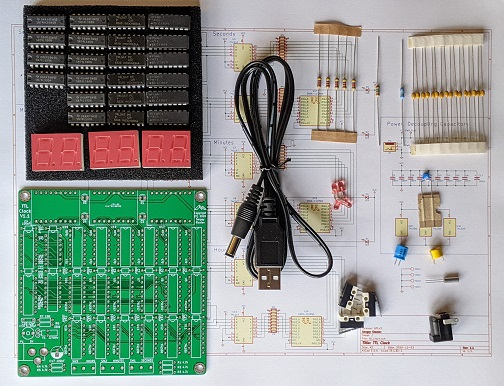
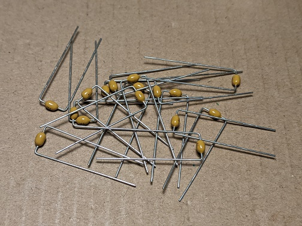
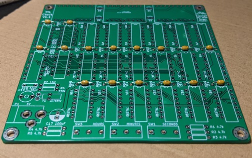
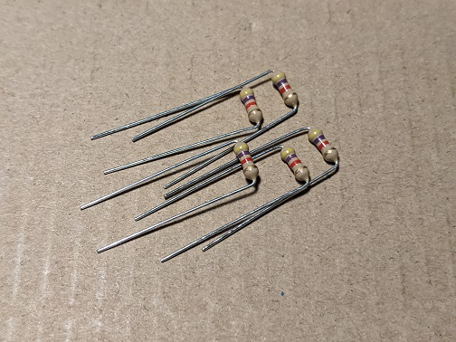
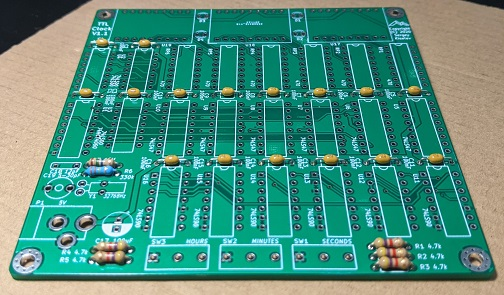
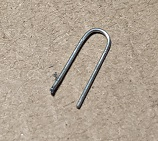
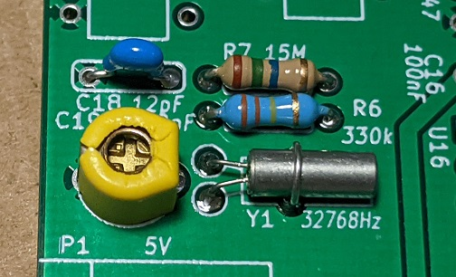
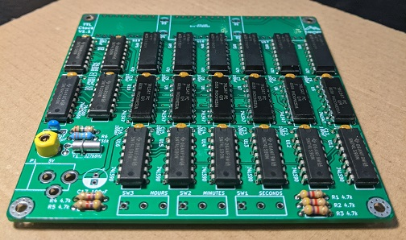
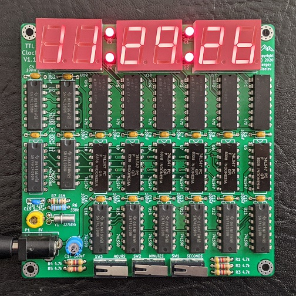

# TTL Clock - Assembly Instructions

## Introduction
TTL Clock is a medium complexity project. While it uses through-hole components only, and therefore requires only basic soldering skills, it contains quite a few components.

## Prerequisites

### Tools and Supplies

* Soldering iron or soldering station
* Needle nose pliers
* Cutters
* Well lit and ventilated workspace
* Solder
* Multimeter (optional)
* ESD safe surface and ESD strap (optional)
* Isopropyl alcohol and a wipe to clean the flux (optional)

### Parts

* TTL Clock parts as described in [Bill of Materials](https://github.com/skiselev/ttl-clock#bill-of-materials)
* USB power supply, or 5V DC power supply with 2.1 mm internal diameter / 5.5 mm external diameter plug

## Assembly Steps

1. Gather supplies and parts
  * Check that you have all the equipment and parts listed in the [Prerequisites](prerequisites) section above
  * Organize your workspace. If available, use ESD-safe surface and ESD strap when working on this project
2. Assemble the components going from lower profile components to higher profile components. Here is the recommended order:
  * Form the leads of 100 nF capacitors as shown on the photo below. Using needle nose pliers, hold the capacitor by the lead close to the capacitor's package, and then bend the lead using your fingers. The distance between bent leads should be 7.62 mm (0.3")

  * Solder capacitors C1 - C16. Note that these are non-polarized ceramic capacitors, so they can be oriented either way. Trim the leads using cutters

  * Form the leads of the resistors. Using your fingers bend the leads down as close to the resistor's package as possible. The distance between bent leads should be 7.62 mm (0.3")

  * Solder 4.7 kohm resistors R1 - R5. These resistors are marked with yellow-purple-red-gold color code. The resistors are not polarized, and can be oriented either way. Trim the leads using cutters
  * Solder 330 kohm resistor R6. This resistor is marked with orange-orange-yellow-gold color code. Trim the leads using cutters
  * Solder 15 Mohm resistor R7. This resistors is marked with brown-green-blue-golden color code. Trim the leads using cutters

  * Form the leads of the crystal oscillator X1. Hold it by the leads with needle nose pliers as close to the package as possible, when gently bend the leads down
  * Solder crystal oscillator. Trim the leads using cutters
  * Using one of the cut resistor leads and needle nose pliers, form a U-shaped bracket to hold the crystal oscillator as shown on the photo below

  * Solder the crystal oscillator bracket. Make sure that it securely holds the crystal oscillator

  * Solder U1 - U16 integrated circuits as follows:
    * Prior to placing an integrated circuit on the board bend its leads slightly, so they point 90 degrees downward. Put the IC on the side gently push it down to bend the leads. Repeat on the other side of the IC
    * Double check that you're placing the integrated circuit in the right spot on the board, check the IC orientation. The index notch on the IC should match the boards silkscreen
    * Solder two oppsite pins (for example, pin 1 and pin 9). Flip the board to the component side, and __check the IC orientation and position again!__ It is not to late to desolder the IC and fix the mistake.
    * Solder remaining pins quickly (3 seconds per pin), to avoid overheating the integrated circuit
  * Solder RR1 - RR6 resistor arrays. Follow integrated circuits instructions in the previous step
  * Solder C18 capacitor. This is a non-polarized ceramic capacitor, so it can be oriented either way
  * Solder C19 trimmer capacitor. This is a non-polarized capacitor, so it can be oriented either way

  * Solder C17 capacitor. Note that this is a __polarized__ electrolytic capacitor and it needs to be oriented properly. Make sure that the negative lead of the capacitor (marked on the package) matches the white colored area on the PCB.
  * Solder LEDs D1 - D4
    * Note that the LEDs are __polarized__. The square pads on the board correspond to the negative (cathode) lead of the LED. The negative leads on the LED usually marked by an indent on otherwise round LED package, or by a shorter lead. The LEDs included in the kit will have their positive leads colored red. If in doubt - use the multimeter (set to diode mode) to check the polarity
    * When soldering LEDs, it is recommended to leave some space between the LED packages and the board and to keep soldering time to minimal to avoid overheating the LED
  * Solder LED displays U17 - U19
    * LED displays are __polarized__. Make sure that they are oriented correctly prior to soldering. The proper orientation can be easily determined by looking at the decimal point on the displays. It should reside on the bottom side on the display (close to the resistor arrays)
    * As with LEDs and integrated circuits, avoid overheading the displays
  * Solder DC power jack P1 
  * Solder SW1 - SW3 switches. Note that switches should be __oriented__ so that the pin 1 is on the left side. Pin 1 is the pin closest to the place where the hinge attaches to the switch. Refer to the picture below
 

3. Double check your work. Make sure that all components and all leads are well soldered
4. If desired, clean the flux residue using wipes or q-tips soaked in isopropyl alcohol. Let the board dry before testing
5. Power on the board. It should work right away!
6. Set the time using the buttons
  * Reset seconds first
  * Set minutes next
  * Finaly set hours
7. If needed fine tune the clock by turning the trim capacitor using a small screw driver. You might want to let the clock run overnight to check if gains or loses time

Congratulations! Enjoy your TTL Clock!
